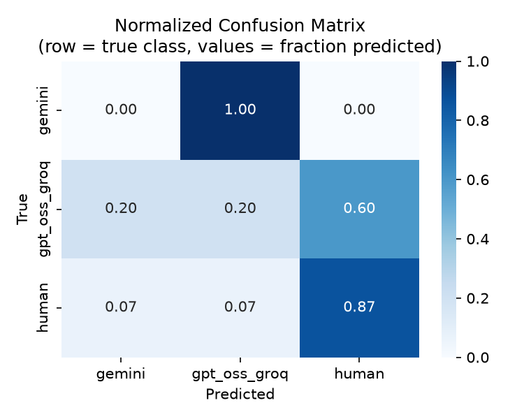
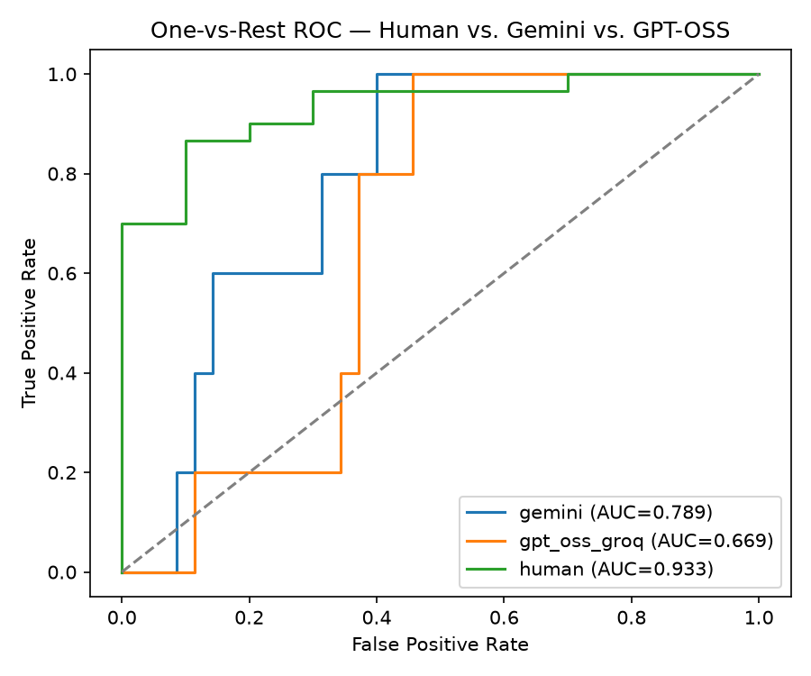
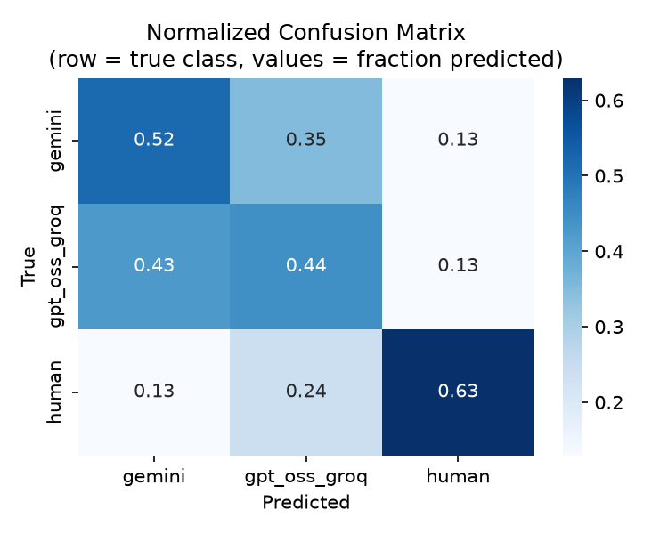
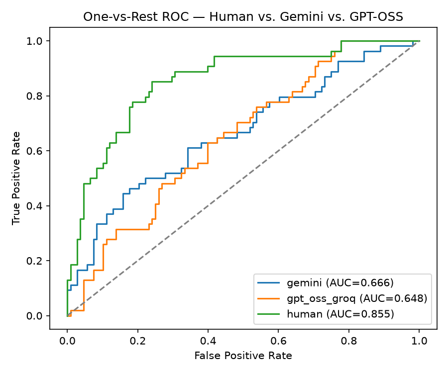

# LLM Attribution: Human vs. Gemini vs. GPT-OSS (English/German)

A portfolio project attributing news-style text to its source — human,
Google Gemini, or OpenAI GPT-OSS 120B (via Groq) — combining classical
stylometric features with multilingual embeddings, evaluated with
one-vs-rest ROC-AUC and a normalized confusion matrix.

Scoped to EN/DE and 3 classes deliberately — see "Design decisions" below
for why.

## Why this project
The posting asks for "detection of AI-generated text content as well as
attribution of which LLM generated which text." A binary human-vs-AI
classifier only covers the first half. This project targets both: it's a
genuine multi-class authorship attribution problem, with LLM families
standing in for individual authors.

## Data
- **Human text**: [ag_news](https://huggingface.co/datasets/fancyzhx/ag_news) (EN),
  [gnad10/10kGNAD](https://huggingface.co/datasets/community-datasets/gnad10) (DE)
- **AI text**: same-topic rewrites from `gemini-3.5-flash-lite` and
  `openai/gpt-oss-120b` (via Groq)

No raw dataset files are committed — only code to reproduce the sample.

## Results
Five runs trace out a clear pattern as sample size increased and class
balancing was corrected:

| Run | Sample size (per lang) | Balanced? | Test support/class | Gemini AUC | GPT-OSS AUC | Human AUC |
|-----|-------------------------|-----------|---------------------|------------|-------------|-----------|
| r1  | 10                      | No (human:AI ≈ 6:1) | not recorded | 0.789 | 0.669 | 0.933 |
| r2  | 30                      | Yes       | 13                  | 0.497      | 0.536       | 0.731     |
| r3  | 60                      | Yes       | 27                  | 0.634      | 0.589       | 0.814     |
| r4  | 60 (same pool as r3, capped by human sample count) | Yes | 28 | 0.566 | 0.527 | 0.777 |
| r5  | 108–120 (human pool expanded)                      | Yes | 54 | 0.666 | 0.648 | 0.855 |

**r1 → r2**: fixing class imbalance dropped every AUC. This looked like a
regression at first, but it wasn't — r1's high numbers came from the
model learning to just guess the majority class (human) most of the
time, which is easy to do well on when human samples outnumber each AI
class 6:1. r2's lower, honest numbers reflect the model actually trying
to distinguish the three classes on equal footing.

**r2 → r3**: doubling the balanced sample size (13 → 27 per class in the
test set) raised every AUC again, this time for a legitimate reason —
more data, less noise. This is good evidence that r2's near-chance
Gemini/GPT-OSS AUC (0.497) was mostly a small-sample artifact, not a
ceiling on how separable these two models' writing actually is.

**r3 vs r4 (same nominal sample size)**: r4 was run after r3, with the
same 60/lang cap still in effect (the human sample pool hadn't yet been
expanded — see Development notes). All three AUCs dropped slightly
(gemini: 0.634 → 0.566, gpt_oss_groq: 0.589 → 0.527, human: 0.814 →
0.777). This is useful context: at this sample size, repeated runs vary
by roughly ±0.07 AUC just from randomness in the train/test split — a
reminder that a single run's numbers shouldn't be over-interpreted
without knowing this noise band.

**r4 → r5**: expanding the human sample pool and nearly doubling the
per-class sample size (60 → 108–120) raised every AUC again, this time
past the r3 level (gemini: 0.566 → 0.666, gpt_oss_groq: 0.527 → 0.648,
human: 0.777 → 0.855). This confirms the r2→r3 pattern held at a larger
scale: more data continues to help, and r4's dip was noise, not a
ceiling.

## Diagnosing separability: data size vs. feature limitations
The r3/r4 comparison raised a natural question: is Gemini-vs-GPT-OSS
attribution weak because the sample size simply isn't enough, or because
the features themselves (stylometric + a paraphrase-oriented embedding
model) lack the signal to separate two RLHF-tuned models in the first
place? These have very different implications — one says "collect more
data," the other says "redesign the features."

`diagnose_separability.py` answers this by comparing training-set AUC
against test-set AUC on the same run. If training AUC is also low, the
model can't fit the data it's seen — the features genuinely lack signal,
and more data won't help. If training AUC is high but test AUC is low,
the model is overfitting a small training set — more data likely will
help.

| Class | r4 Train AUC | r4 Test AUC | r4 Gap | r5 Train AUC | r5 Test AUC | r5 Gap |
|-------|--------------|-------------|--------|---------------|-------------|--------|
| Gemini   | 0.997 | 0.566 | 0.431 | 0.976 | 0.666 | 0.310 |
| GPT-OSS  | 0.995 | 0.527 | 0.469 | 0.962 | 0.648 | 0.314 |
| Human    | 0.999 | 0.777 | 0.222 | 0.989 | 0.855 | 0.135 |

Nearly doubling the sample size (60 → 108/class) shrank the gap across
all three classes, in the same direction and at a similar magnitude.
This is direct evidence that the low test-set AUC was a data-size /
overfitting problem, not a feature or embedding-model limitation — if
the embedding model (`paraphrase-multilingual-MiniLM-L12-v2`, trained to
make paraphrases of the same content embed *closer together*, arguably
counterproductive for a task that needs to distinguish *style* between
same-topic rewrites) were the real bottleneck, training AUC would have
stayed low too, since the model wouldn't be able to fit the training
data well in the first place. Instead, training AUC stayed high (0.96+)
while test AUC climbed and the gap shrank — the signature of overfitting
being diluted by more data, not a fundamentally wrong feature choice.

**r1 (before balancing, 10/lang, misleadingly high AUC):**



**r5 (balanced, 108–120/lang, current best result):**



Human-vs-AI separation is consistently the strongest signal across all
five runs. Gemini-vs-GPT-OSS attribution is real but weaker — expected,
since both are RLHF-tuned models producing broadly similar prose on the
same short rewriting task.

## Archive
`archive/` holds snapshots from earlier runs, kept for comparison — the
files a script actually reads/writes (`data/*.csv`, `outputs/*.png`) get
overwritten every run, so anything worth keeping has to be copied out
first.

Naming: `r{N}_{filetype}.{ext}` — `r1`, `r2`, `r3`... in chronological
order. See the table above for what each run's parameters were.

```
archive/
├── r1_features.csv       # 10/lang, gemini-3.6-flash, unbalanced
├── r1_confusion.png
├── r1_roc.png
├── r2_ai_samples.csv     # 30/lang, gemini-3.5-flash-lite, balanced
├── r2_features.csv
├── r2_confusion.png
├── r2_roc.png
└── ...
```

## Design decisions
- **3 classes, not 4+**: two AI lineages already demonstrates the
  attribution mechanism.
- **Gemini + Groq specifically**: both free, no credit card; Groq needs
  no phone verification.
- **Class balancing before training**: the human dataset naturally has
  2x the samples of each AI class (more human articles are downloaded
  than get rewritten). Training on the imbalanced data caused the model
  to systematically over-predict "human" — downsampling every
  (origin, language) group to match the smallest group fixed this. This
  is itself a useful thing to be able to explain: it's a real example of
  diagnosing *why* a model underperforms rather than just reporting a
  number.

## Method
1. Load human news samples (`load_human_text.py`).
2. Generate same-topic rewrites from two LLM providers (`generate_ai_text.py`).
3. Extract stylometric features (`stylometric_features.py`).
4. Balance classes, concatenate stylometric + embedding features, train a
   Logistic Regression, evaluate with one-vs-rest ROC-AUC and a
   normalized confusion matrix (`train_classifier.py`). A standalone
   diagnostic (`diagnose_separability.py`) additionally reports
   training-set AUC alongside test-set AUC on any saved run's features
   file — this distinguishes "not enough data" (both train and test AUC
   low) from "overfitting" (train AUC high, test AUC low, big gap)
   without needing to regenerate any data.
5. Case study (not yet implemented — see Known limitations): simplified
   statistical watermarking (`watermark_demo.py`).
6. Streamlit demo (`app.py`).

## Development notes
Building this surfaced several real-world issues worth documenting:
- **Upstream dataset renaming**: `ag_news` and `gnad10` now require full
  namespaces (`fancyzhx/ag_news`, `community-datasets/gnad10`) after a
  HuggingFace Hub repo reorganization.
- **Model deprecations mid-project**: `llama-3.3-70b-versatile` was
  deprecated by Groq; `gemini-3.6-flash`'s free tier turned out to be
  only 20 requests/day, too low for this project's needs — switched to
  `gemini-3.5-flash-lite` (500 requests/day, though only 15/minute,
  requiring a longer per-request delay).
- **Windows CSV encoding**: opening output CSVs in Excel silently
  re-saves them in a non-UTF-8 encoding; fixed by always specifying
  `encoding="utf-8"` explicitly on every read/write, and by not opening
  CSVs in Excel during development.
- **Class imbalance** (see Design decisions above).
- **pandas API change**: `groupby().apply(lambda g: ...)` started
  dropping the grouping columns from the result in a recent pandas
  version; replaced with the built-in `groupby().sample()`, which is
  both more robust and more idiomatic for this exact use case.
- **Groq daily token limit (TPD)**: `openai/gpt-oss-120b`'s free tier
  caps at 200,000 tokens/day, separate from its per-minute limits. Ran
  into this generating a 120/lang batch — English completed, German was
  cut short partway through. Unlike Gemini (Pacific time reset), Groq's
  daily quotas reset at UTC midnight.
- **Groq RPM limit**: also discovered `openai/gpt-oss-120b`'s free tier
  caps at 30 requests/minute; the original 1.5s sleep interval allowed
  ~40/minute, exceeding it. Fixed to 2.1s.
- **Traceable pairing (`source_id`)**: originally, AI-generated rows had
  no reference back to which human text they were rewritten from —
  pairing relied on both files being read in the same order every time,
  which is fragile (e.g., if the human sample pool is ever regenerated
  or reshuffled). Added an explicit `sample_id` column to
  `human_samples.csv` and a matching `source_id` column to
  `ai_samples.csv`, so any AI row can always be traced back to its exact
  source text regardless of file order.

## Known limitations
- Sample size was not scaled beyond ~108-120/class within a single day,
  due to Groq's daily token quota (200K tokens/day) on the free tier —
  not a technical ceiling, just a same-day constraint. Given the r4→r5
  trend, further scaling would likely continue narrowing the gap, but
  the current result is already sufficient to demonstrate the
  data-size-vs-features diagnosis.
- Only 2 AI lineages; a 3rd would strengthen the cross-lineage story.
- Watermark case study is designed but not yet implemented.
- Scoped to EN/DE only.

## Setup
```bash
pip install -r requirements.txt
python load_human_text.py
export GEMINI_API_KEY=your_key_here   # aistudio.google.com, free, no card
export GROQ_API_KEY=your_key_here     # console.groq.com, free, no card
python generate_ai_text.py
python stylometric_features.py
python train_classifier.py
streamlit run app.py
```
